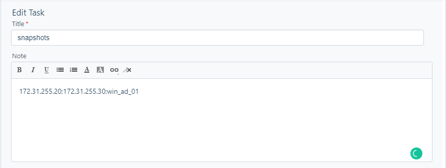

# AWS Snapshot Automation

-   [Overview](#overview-section)
-   [Technical Section](#technical-section)
-   [Admin Section](#admin-section)
-   [User Section](#user-section)
-   [Troubleshooting](#troubleshooting-section)


## [Overview](#overview-section)

In order to facilitate snapshot taking on Amazon Web Services and also
to reduce human error-prone, a script has been deployed to automate this
task.

The link to the GitHub repo can be found
[here](https://github.com/mervin-hemaraju-cko/aws-snapshot-script).

This document can be decoupled into 3 main parts:

-   [The Technical Section](#technical-section) (A peek inside the code)

-   [The Admin Section](#admin-section) (How to deploy the script)

-   [The User Section](#user-section)  (How to use the script)

## [Technical Section](#technical-section)

The script has been coded fully in Python Programming Language.

The dependencies below have been used in the script:

-   [Boto3 (AWS Python SDK)](https://boto3.amazonaws.com/v1/documentation/api/latest/index.html)

-   [Fresh Service API V2](https://api.freshservice.com/v2/)

-   [Slack API](https://api.slack.com/)

When a user executes the script, the following actions are executed in
order:

1.  The target servers information are taken from FreshService Change
    tickets using the Fresh Service API

2.  Using the captured server information, they are processed in Boto3,
    which is the Python SDK for Amazon Web Services, which in turn will
    return the matched instance.

3.  The instance is then processed further to obtain its root volume ID.

4.  The snapshots of the root volume IDs are taken.

5.  A message is sent to Slack with a list of all snapshots IDs created
    using the Slack API.

*Code Sample*
--------------

Below are some core code samples:

#### Query the instance from AWS using Boto3

``` 
def query_instance(client, filters):

    response = client.describe_instances(Filters=filters)

    for r in response['Reservations']:

        for i in r['Instances']:

            return Instance.load(i)

    raise Exception(Const.EXCEPTION_NOT_FOUND_INSTANCE.format(
        filters[0]['Values'][0]))
```

#### Create snapshots using the Boto3 client

``` 
def create_snapshots(client, snapshot_requests):

    # Initialize empty list of results strings
    results = []

    # Iterate through each snapshot requests
    for sr in snapshot_requests:

        # Create a tag for each snapshot
        # Tag should consist of Name with the format: TodaysDate_ServerName_Snapshot
        tags = Const.require_tags_template(
            f"{Helper.format_today()}_{sr.hostname}_snapshot", sr.agent)

        # Create the snapshot
        response = client.create_snapshot(
            Description=Const.DESC_SNAPSHOT.format(sr.hostname),
            VolumeId=sr.volume_id,
            TagSpecifications=Const.require_tags_spec_template(tags)
        )

        # Log the message
        log(Const.MESSAGE_SNAPSHOT_CREATED.format(
            sr.hostname, response['SnapshotId']))

        # Add message to results
        results.append(Const.MESSAGE_SNAPSHOT_CREATED.format(
            sr.hostname, response['SnapshotId']))

    # Return results
    return results
```

#### Post messages to Slack using the Slack API

``` 
def post_to_slack(message, blocks=None):

    response = requests.post('https://slack.com/api/chat.postMessage', {
        'token': os.environ["ENV_SLACK_KEY_API"],
        'channel': os.environ["ENV_SLACK_CHANNEL"],
        'text': message,
        'icon_url': "",
        'username': os.environ["ENV_SLACK_USERNAME"],
        'blocks': json.dumps(blocks) if blocks else None
    }).json()

    if response['ok'] != True:
        raise Exception(Const.EXCEPTION_MESSAGE_ERROR_SLACK)
```

## [Admin Section](#admin-section)

The admin section defines how to install and deploy the script in a
production environment.

To be able to run the script on your machine, you will need a
combination of installed dependencies and environment variables pre-set
on the machine.

*Dependencies*
--------------

To install the dependencies, run the following command in the root
project directory:

`pip install -r requirements.txt`

*Environment Variables*
-----------------------

A set of environment variables is necessary to be initialized before
running the script.

The list below can be written in a `.env` file and then use the command
`source file.env` to export the environment variables.

``` 
export ENV_FRESH_SERVICE_KEY_API_B64=""
export ENV_FRESH_SERVICE_URL="https://checkoutsupport.freshservice.com/api/v2"

export ENV_SLACK_KEY_API=""
export ENV_SLACK_CHANNEL=""
export ENV_SLACK_USERNAME=""
```

No secret keys are defined for Boto3 as it will make use of the
underlying profiles of AWS CLI to run on the desired AWS environment.

## [User Section](#user-section)

### Instructions

There are a set of instructions to **strictly**follow in order to run
the script correctly.

1.  The correct AWS profile needs to be switched to the desired
    environment before running the script.

2.  A list of tasks should be defined in Fresh Service in the following
    syntax (A screenshot has been inserted below):

    -   Only tasks with a title of **snap:server\_name** will take
        snapshots. Here **server\_name**is the name of the server
        machine on AWS

    -   The task description should contain the IP address of the
        machine.

    -   The script will not take **Closed** tasks into considerations.

    -   

### Run the Script

Finally, you can run the script by going on the hosting server (where
the script is hosted), navigating to the root folder of the script, and
running the following command:
`python main.py -t <ticketnumber> -a <agentname>` (Note that both
**ticket number** and **agent name** parameter are mandatory)

Below is the usage guide of the command:

``` 
$ python main.py
usage: main.py [-t] [-a] [-h]

Required arguments:
-t, --ticket           The ticket number to process
-a, --agent            The agent running the scrip (firstname.lastname@checkout.com)

optional arguments:
 -h  show this help message and exit
```

## [Troubleshooting](#troubleshooting-section)

Several situations can cause the script to fail. Some situations can be
due to wrong input(data) or a lack of internet connectivity.

Below are some basic scenarios and their impact:

### What happens if an error occurs?

Several situations can cause the script to fail. Basic scenarios have
been listed below:

-   **The server has lost internet connection**

    -   If the server running the script loses internet connection, a
        connection timeout will occur when trying to fetch the
        information from Fresh Service and the script will stop

-   **Incorrect IP Address given**

    -   At any point, if an incorrect IP address has been inserted
        through a task, the script will cancel all snapshot creations.
        This is so that confusion can be alleviated as to which
        snapshots have been created and which have not. A message will
        be sent to the Slack Channel informing you about the error.

-   **The correct IP address is given but the wrong server name has been
    given in the description.**

    -   At this point, the snapshots of the servers will be created from
        the IP address given. The only issue here is the tag will
        contain a wrong server name which can be manually corrected.

-   **Wrong ticket number provided**

    -   If the wrong ticket doesn’t contain any syntax which will cause
        snapshots to be taken, the script will just stop with the result
        of no snapshot requests found.

    -   If the wrong ticket does contain snapshot request syntax,
        snapshots will be taken for the given servers. The user will
        then have to manually delete the snapshots on the AWS console.

### Advanced troubleshooting

Sometimes, the error will not be as predictive of the error message
given. To further troubleshoot an issue, each time the script is run, a
set of log files is generated and stored in the `log` folder in the root
folder of the project.

Logs file are created for each date and time the script is run and is in
the following format:

``` 
2021-04-15 20:07:21,562 DEBUG retryhandler.py 187 No retry needed.
2021-04-15 20:07:21,562 DEBUG main.py 160 An unexpected error occurred: name 'agent' is not defined
```
